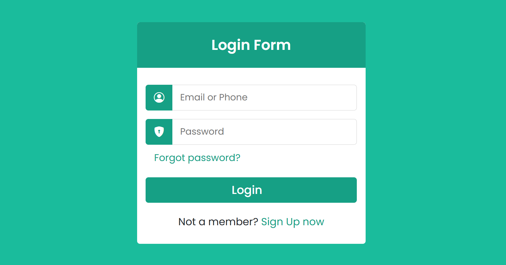

# Login Form Project



A simple and responsive **login form** built using **HTML** and **CSS**.

## Features

- Clean and modern design  
- Responsive layout  
- Hover and focus effects  

## Technologies Used

- HTML5  
- CSS3 (Flexbox & Grid)  

## How to Use

1. Clone the repository:  
   ```sh
   git clone https://github.com/Amine4jh/login-form-project.git
    ```

2. Open index.html in your browser.
